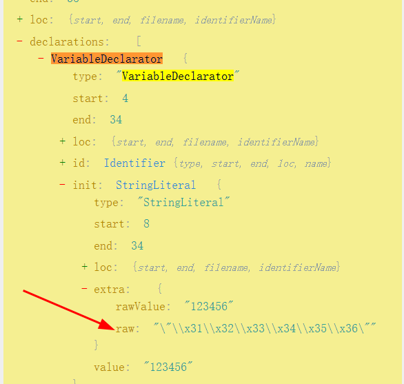

# AST操作之删除节点

需求：还原十六进制字符串,比如需要处理的这样一个字串

```javascript
var a = "\x31\x32\x33\x34\x35\x36";
```

这里可以看到raw字段显示的是十六进制字符串



删除raw字段，就恢复十进制字符串

```javascript
const fs = require('fs');
const {parse} = require("@babel/parser");
const traverse = require("@babel/traverse").default;
const generator = require("@babel/generator").default;
let encode_file = "./encode.js";

let js_code = fs.readFileSync(encode_file, {encoding: "utf-8"});
let ast = parse(js_code, {
    sourceType: 'module',
});


const visitor = {
    StringLiteral(path) {
        // 删除多余字段
        delete path.node.extra.raw;
    },
};

traverse(ast, visitor);

// 将修改后的AST重新生成为代码
const modifiedCode = generator(ast).code;
console.log(modifiedCode);
```

需求：将`var a = "123", b = 123;`中的`a = "123"`删除

```javascript
const fs = require('fs');
const {parse} = require("@babel/parser");
const traverse = require("@babel/traverse").default;
const generator = require("@babel/generator").default;
let encode_file = "./encode1.js";

let js_code = fs.readFileSync(encode_file, {encoding: "utf-8"});
let ast = parse(js_code, {
    sourceType: 'module',
});

const visitor = {
    VariableDeclarator(path) {
        let init = path.get('init')
        if(init.isStringLiteral()){
            // 判断将整个节点删除
            path.remove()
        }
    },
};

traverse(ast, visitor);

// 将修改后的AST重新生成为代码
const modifiedCode = generator(ast).code;
console.log(modifiedCode);
```

需求：将如下代码中的`crack();`删除
```javascript
function test(){
    var a = 123;
    c = a + b;
    crack();
}
```
实现代码
```javascript
const fs = require('fs');
const {parse} = require("@babel/parser");
const traverse = require("@babel/traverse").default;
const generator = require("@babel/generator").default;
let encode_file = "./encode2.js";

let js_code = fs.readFileSync(encode_file, {encoding: "utf-8"});
let ast = parse(js_code, {
    sourceType: 'module',
});

const visitor = {
    BlockStatement(path) {
        // path.node.body 是直接访问当前节点的 body 属性的值，返回一个数组（通常是一组语句节点）。
        // path.get('body') 是通过路径对象的方法获取当前节点的 body 属性的子路径，你可以在这个子路径上进行更多的操作。
        let body = path.node.body;
        console.log(body);
        body.pop()
    },
};

traverse(ast, visitor);

// 将修改后的AST重新生成为代码
const modifiedCode = generator(ast).code;
console.log(modifiedCode);
```