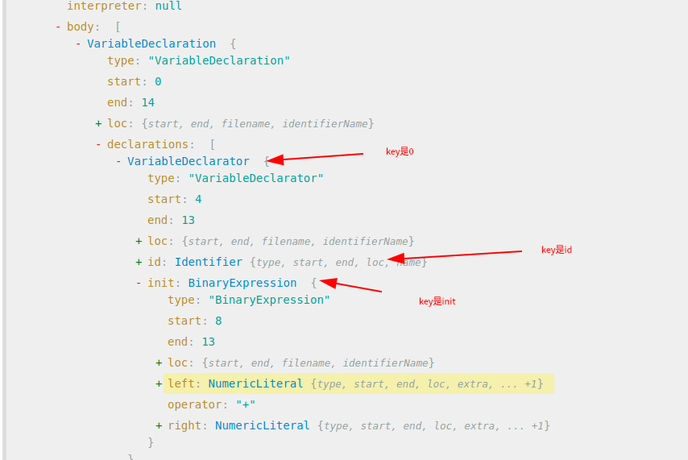

# AST操作之API用法-path路径

## path 路径

在`@babel/traverse`模块中，path对象表示一个节点（node）在AST树中的位置，提供了一些属性和方法，
用于访问节点的属性、子节点、父节点、兄弟节点等，并且可以对AST树进行修改。

读取js代码并转换为ast树

```javascript
const fs = require('fs');
const {parse} = require("@babel/parser");
const traverse = require("@babel/traverse").default;
const generator = require("@babel/generator").default;
let encode_file = "./encode.js";

let js_code = fs.readFileSync(encode_file, {encoding: "utf-8"});
let ast = parse(js_code, {
    sourceType: 'module',
});
```

## path 属性

`path`属性相关的源代码在这个js文件中

```javascript
\node_modules\@babel\traverse\lib\path
```

**下面是一些常见的path对象的属性API：**

| api                            | 功能                                                                 |
|--------------------------------|--------------------------------------------------------------------|
| path.node                      | 获取当前路径对应的节点。                                                       |
| path.parent                    | 获取当前路径对应节点的父节点。                                                    |
| path.parentPath                | 获取当前路径对应节点的父路径。                                                    |
| path.scope                     | 表示当前path下的作用域，这个也是写插件经常会用到的。                                       |
| path.container                 | 用于获取当前path下的所有兄弟节点(包括自身)。                                          |
| path.type                      | 获取当前path的节点类型。                                                     |
| path.key                       | 获取当前path的key值，key通常用于path.get函数。                                   |

**打印当前路径所对应的某个节点信息**

需求：打印type、start、end、loc、sourceType、interpreter、body等信息


编写代码

```javascript
const visitor = {
    Program(path) {
        console.log(path.node.type);
        console.log(path.node.start);
        console.log(path.node.end);
        console.log(path.node.loc);
        console.log(path.node.sourceType);
        console.log(path.node.interpreter);
        console.log(path.node.body);
        console.log(path.node.directives);
    },
}
traverse(ast, visitor);
```

打印内容：

```javascript
Program
0
12
SourceLocation
{
    start: Position
    {
        line: 1, column
    :
        0, index
    :
        0
    }
,
    end: Position
    {
        line: 1, column
    :
        12, index
    :
        12
    }
,
    filename: undefined,
        identifierName
:
    undefined
}
script
null
    [
    Node
{
    type: 'VariableDeclaration',
        start
:
    0,
        end
:
    12,
        loc
:
    SourceLocation
    {
        start: [Position],
            end
    :
        [Position],
            filename
    :
        undefined,
            identifierName
    :
        undefined
    }
,
    declarations: [[Node]],
        kind
:
    'var'
}
]
[]
```

**判断path是什么type，使用path.isXXX 这个方法**

需求：遍历所有节点，输出节点类型为NumericLiteral的value值

```javascript
const visitor = {
    enter(path) {
        if (path.isNumericLiteral()) {
            console.log(path.type);
            console.log(path.node.value);
        }

    },
}

traverse(ast, visitor);
```

打印内容：

```javascript
NumericLiteral
123
```

**获取path的上一级路径path.parentPath;**

需求：获取上一级路径节点类型

```javascript
const visitor = {
    enter(path) {
        if (path.isNumericLiteral()) {
            console.log('当前节点类型:' + path.type);
            console.log('上层节点类型:' + path.parentPath.type);
        }
    },
}

traverse(ast, visitor);
```

打印内容：

```javascript
当前节点类型:NumericLiteral
上层节点类型:VariableDeclarator
```

**获取当前path的key值**

需求：打印节点VariableDeclarator|BinaryExpression|Identifier的key值

```javascript
const {parse} = require("@babel/parser");
const traverse = require("@babel/traverse").default;

let js_code = "var a = 1 + 2;";

let ast = parse(js_code, {
    sourceType: 'module',
});

const visitor = {
    "VariableDeclarator|BinaryExpression|Identifier"(path) {
        console.log(path.key)
    },
}

traverse(ast, visitor);
```



## path 方法

`path`方法相关的源代码在这个js文件中

```javascript
node_modules\@babel\traverse\lib\path\index.js
\node_modules\@babel\traverse\lib\path
```

| api                                | 功能                                                                 |
|------------------------------------|--------------------------------------------------------------------|
| path.get(key)                      | 获取当前路径下指定属性名（key）对应的子路径。例如，path.get("body") 获取当前路径下名为 "body" 的子路径。 |
| path.getSibling(index)             | 获取当前路径对应节点的兄弟节点的路径。通过指定索引（index）可以获取相应的兄弟路径。                       |
| path.getFunctionParent()           | 获取当前路径对应节点的最近的函数父节点的路径。                                            |
| path.getPrevSibling()              | 获取当前path的前一个兄弟节点，返回的是path类型。                                       |
| path.getAllPrevSiblings()          | 获取当前path的所有前兄弟节点，返回的是Array类型，其元素都是path类型。                          |
| path.getNextSibling()              | 获取当前path的后一个兄弟节点，返回的是path类型。                                       |
| path.getAllNextSiblings()          | 获取当前path的所有后兄弟节点，返回的是Array类型，其元素都是path类型。                          |
| path.evaluate()                    | 用于计算表达式的值，大家可以参考 constantFold 插件的写法。                               |
| path.findParent()                  | 向上查找满足回调函数特征的path，即判断上级路径是否包含有XXX类型的节点。                            |
| path.find()                        | 功能与 path.findParent 方法一样，只不过从当前path开始进行遍历。                         |
| path.getFunctionParent()           | 获取函数类型父节点，如果不存在，返回 null。                                           |
| path.getStatementParent()          | 获取Statement类型父节点，这个基本上都会有返回值，如果当前遍历的是 Program 或者 File 节点，则会报错。     |
| path.getAncestry()                 | 获取所有的祖先节点，没有实参，返回的是一个Array对象。                                      |
| path.isAncestor(maybeDescendant)   | 判断当前遍历的节点是否为实参的祖先节点.                                               |
| path.isDescendant(maybeAncestor)   | 判断当前遍历的节点是否为实参的子孙节点.                                               |
| path.traverse(visitor)             | 遍历当前路径下的所有子节点，并应用指定的 visitor。                                      |
| path.replaceWith(node)             | 用指定的节点替换当前路径对应的节点。                                                 |
| path.remove()                      | 从 AST 中移除当前路径对应的节点。                                                |
| path.insertBefore(nodes)           | 在当前路径对应节点之前插入一个或多个节点。                                              |
| path.insertAfter(nodes)            | 在当前路径对应节点之后插入一个或多个节点。                                              |
| path.insertAfter(nodes)            | 在当前路径对应节点之后插入一个或多个节点。                                              |
| path.toString()                    | 用于将 AST 节点转换回对应的源代码字符串。                                            |

**删除path，使用remove方法**

需求：删除变量值

```javascript
const visitor = {
    enter(path) {
        if (path.isNumericLiteral()) {
            path.remove()
        }
    },
}

traverse(ast, visitor);

let {code} = generator(ast);
console.log(code)
```

打印内容：

```javascript
var a;
```

**替换path，单路径可以使用`replaceWith`方法，多路径则使用`replaceWithMultiple`方法**

需求：把var a = 123; 修改成var a = 3 ，用replaceWith方法

```javascript
const visitor = {
    enter(path) {
        if (path.isNumericLiteral() && path.node.value == 123) {
            path.replaceWith({type: "NumericLiteral", value: 3});
        }
    },
}

traverse(ast, visitor);
```

打印内容：

```javascript
var a = 3;
```

注意点，必须加上`&& path.node.value == 123`判断，否则就是无限循环

**当前路径所对应的源代码**

需求：打印当前路径所对应的源代码

```javascript
const visitor = {
    VariableDeclaration(path) {
        console.log(path.toString());
    },
}

traverse(ast, visitor);
```

打印内容：

```javascript
var a = 123;
```