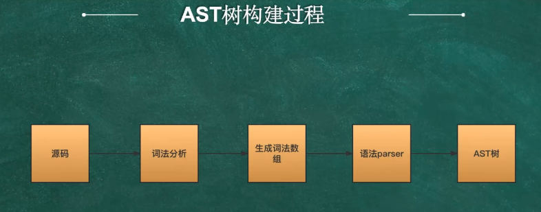
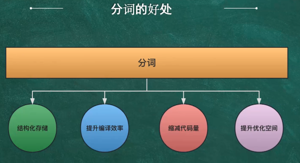
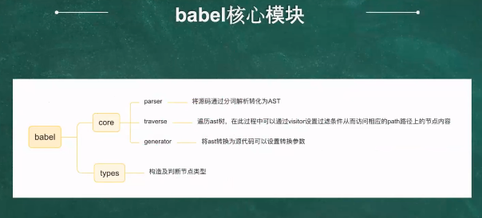

## ast 构建过程

源码--》词法分析--》生成词法数组--》语法parser--》ast树

浏览器会把源码转换成ast树再转换成字节码



## ast 构建细节

遍历源码进行分词算法生成`tokens`数组，再遍历`tokens`数组进行语法解析，最终生成ast树，顶层是一个`Program`程序，
start代码开始位置，end是代码结束位置，body是具体代码内容。


主要的代码映射关系`Identifier`标识符是a,`init`初始化为1

```json
{
  "type": "VariableDeclaration",
  "start": 0,
  "end": 10,
  "declarations": [
    {
      "type": "VariableDeclarator",
      "start": 4,
      "end": 9,
      "id": {
        "type": "Identifier",
        "start": 4,
        "end": 5,
        "name": "a"
      },
      "init": {
        "type": "Literal",
        "start": 8,
        "end": 9,
        "value": 1,
        "raw": "1"
      }
    }
  ],
  "kind": "var"
}
```

为什么要分词生成`tokens`数组



## babel 核心模块



## 理解path和node

path就是路径，node就是节点，找到某个node节点必须通过path，所有node节点都是绝对路径


## path api

node可以通过path上api进行操作的


