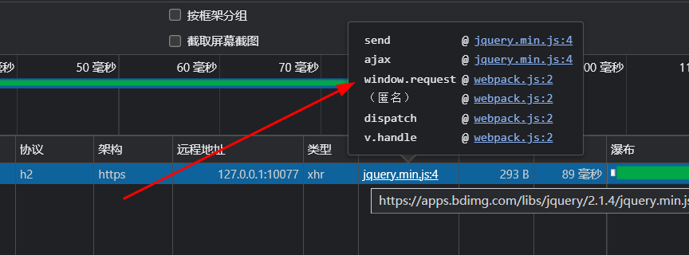

# 猿人学第16题-webpack-调试跳转-指纹-window删除陷阱-纯手撕版

老版本反爬

    打开f12发现直接跳转到首页

        https://blog.csdn.net/sonichty/article/details/106337097

    添加新书签，网址为以下JS：

        javascript:window.addEventListener('beforeunload', function (e) { e.preventDefault();e.returnValue = '' });

新反爬是控制台无限输出


油猴插件解决问题
```javascript
// ==UserScript==
// @name        hook setInterval debugger console
// @namespace   http://tampermonkey.net/
// @version     0.1
// @description pass
// @author      ayf
// @run-at      document-start
// @match       *://*/*
// @grant       none
// ==/UserScript==

(function() {
    var new_setInterval=setInterval;
    window.setInterval=function(a,b){
        if(a.toString().indexOf("debugger")!=-1)
        {
            return null;
        }
        if(a.toString().indexOf("console.log")!=-1)
        {
            return null;
        }
        if(a.toString().indexOf("console.clear")!=-1)
        {
            return null;
        }
        new_setInterval(a,b);
    }
})();
```

网页加载完后，点击这个书签注入JS

下面开始查请求内容

    https://match.yuanrenxue.com/api/match/16?page=1&m=yRGKX8mcMrTseFH04e67aa2178c08b2cbead16007e5bd66DSJ6YzK5KF&t=1650734803000
    https://match.yuanrenxue.com/api/match/16?page=1&m=x6SpyZZMNySDd7td1f3ce3d0c4c6bde96f904d2d8a428aaYDCZS2Sdxk&t=1650734804000
    https://match.yuanrenxue.com/api/match/16?page=1&m=x2BFAdXwr7d4G6md1f3ce3d0c4c6bde96f904d2d8a428aaBDe5nNDkmX&t=1650734805000

`m`就是一个变量值，这里直接控制台调试



开始打断点，找到加密点


这里可以看到`btoa`编码加密
```javascript
r.m = n[e(528)](btoa, p_s)
```
用正常浏览器测试


用当前环境测试


这里就可以知道函数`btoa`是被魔改过的，查看主体逻辑


找到主逻辑，这里的`u(208)`就是`btoa`

```javascript
window[u(208)] = function(e) {
    var t = u
      , r = {};
    r.TGmSp = t(244) + "ARACTER_ERR",
    r[t(238)] = t(224) + t(250) + "/",
    r[t(205)] = "^([^ ]+( +" + t(230) + t(259),
    r.aYkvo = function(e) {
        return e()
    }
    ,
    r[t(254)] = function(e, t) {
        return e % t
    }
    ,
    r.evetF = function(e, t) {
        return e >> t
    }
    ,
    r.GfTek = t(196),
    r[t(260)] = function(e, t) {
        return e << t
    }
    ,
    r[t(229)] = function(e, t) {
        return e | t
    }
    ,
    r[t(242)] = function(e, t) {
        return e << t
    }
    ,
    r[t(228)] = function(e, t) {
        return e & t
    }
    ,
    r[t(207)] = function(e, t) {
        return e << t
    }
    ,
    r[t(202)] = function(e, t) {
        return e & t
    }
    ,
    r.jdwcO = function(e, t) {
        return e === t
    }
    ,
    r.kPdGe = t(231),
    r[t(195)] = t(213),
    r[t(201)] = function(e, t) {
        return e & t
    }
    ,
    r[t(206)] = function(e, t) {
        return e == t
    }
    ,
    r[t(219)] = function(e, t) {
        return e + t
    }
    ,
    r[t(220)] = function(e, t) {
        return e(t)
    }
    ;
    var i = r;
    if (/([^\u0000-\u00ff])/.test(e))
        throw new Error(i.TGmSp);
    for (var o, a, s, l = 0, c = []; l < e[t(261)]; ) {
        switch (a = e[t(237)](l),
        s = i.kukBH(l, 6)) {
        case 0:
            delete window,
            delete document,
            c[t(246)](f[t(245)](i[t(212)](a, 2)));
            break;
        case 1:
            try {
                "WhHMm" === i[t(198)] || n.g && c[t(246)](f[t(245)](i.pHtmC(2 & o, 3) | i.evetF(a, 4)))
            } catch (e) {
                c[t(246)](f[t(245)](i[t(229)](i.cVCcp(3 & o, 4), a >> 4)))
            }
            break;
        case 2:
            c[t(246)](f[t(245)](i[t(229)](i[t(242)](15 & o, 2), i.evetF(a, 6)))),
            c[t(246)](f[t(245)](i[t(228)](a, 63)));
            break;
        case 3:
            c[t(246)](f[t(245)](i[t(212)](a, 3)));
            break;
        case 4:
            c.push(f[t(245)](i[t(229)](i[t(207)](i.OWUOc(o, 4), 6), i[t(212)](a, 6))));
            break;
        case 5:
            c[t(246)](f[t(245)](i[t(229)](i[t(207)](i[t(202)](o, 15), 4), a >> 8))),
            c.push(f.charAt(i[t(202)](a, 63)))
        }
        o = a,
        l++
    }
    return 0 == s ? i[t(226)](i[t(241)], i[t(195)]) || (c[t(246)](f[t(245)](i[t(201)](o, 3) << 4)),
    c.push("FM")) : i.eMnqD(s, 1) && (c[t(246)](f[t(245)]((15 & o) << 2)),
    c[t(246)]("K")),
    i[t(219)](i.aQCDK(d(15), window.md5(c[t(234)](""))), i[t(220)](d, 10))
}
```
仔细观察代码，发现大量出现t(226)，**函数字面量**，尝试用AST解混淆